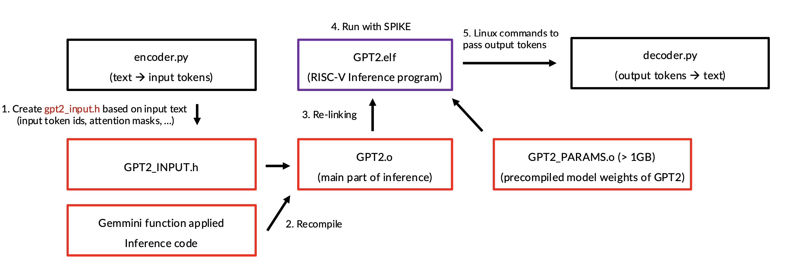

# Gemmini LLM Evaluation & Demo

This project is a software simulation for evaluating Gemmini's GPT2-small model using the SPIKE simulator.

## Description

This project is a beta-test for a FireSim demo using the SPIKE simulator. It consists of C-ported GPT2-small inference code, along with Python programs (encoder.py and decoder.py) that handle text-to-token and token-to-text conversion. The shell script (`gpt2_generator.sh`) allows you to input text and retrieve the generated text output.

## Installation

To begin, you need to install Chipyard in your root directory (this is important!). The shell script will not function correctly if Chipyard is installed in any other location. You can refer to the official [Gemmini project repository](https://github.com/ucb-bar/gemmini) for instructions.

Next, install the SPIKE functional simulator and modify the Gemmini configuration.

1. Navigate to the Gemmini configuration file:

   ```bash
   cd ~/chipyard/generators/gemmini/configs
   vi GemminiCustomConfigs.scala
   ```

2. Update the `customConfig`:

   ```scala
   // val customConfig = baselineInferenceConfig
   val customConfig = defaultFpConfig
   ```

3. Build SPIKE:

   ```bash
   cd ~/chipyard/generators/gemmini
   ./scripts/build-spike.sh
   ```

Next, navigate to the root directory of the project and extract the model weights:

```bash
python ./tools/extract_weights.py
```

## Usage

To execute the script, source the environment. Then, move to the root directory of the project and run the `gpt2_generator.sh` script:

```bash
conda activate base
source ~/chipyard/env.sh
./gpt2_generator.sh [baremetal | pk] [matmul_option] [verbose]
```

- `baremetal`: Compile and run GPT-2 on bare metal.
- `pk`: Compile and run GPT-2 with `pk` and optional `matmul_option` and `verbose`.
- `matmul_option`: One of `'os'`, `'ws'`, or `'cpu'` (only for `pk`).
- `verbose`: Enable verbose mode (only for `pk`).

Since baremetal execution doesn't accept arguments, the `matmul_option` and `verbose` are available only in `pk` mode. By default, the matmul option is set to "WS" and verbose mode is off.

### Example Usage

```bash
./gpt2_generator.sh baremetal
./gpt2_generator.sh pk cpu
./gpt2_generator.sh pk os verbose
```

Upon execution, the script prompts for the number of queries:

```
Enter the number of queries you want to ask: 
Query 1: 
.
.
.
Query N: 
Enter the length of the sequence you want to generate:
```

The sequence length determines the length of the output tokens, not the number of words in the output text.

**Note:** The first time you run the shell script, it will take a long time (~20 minutes) to compile everything, including the model weights .c file (over 1GB).  Executions after it will be faster, as only files related to your input will be recompiled.

## Configuration

The SPIKE simulator runs RISCV programs on an x86 environment, which takes considerable time to run large C programs. Since the GPT-2 model requires loading 500MB of weights and performing extensive GEMM computations, standard file I/O would make the process infeasible (taking over a week for completion).

To mitigate this, the project implements the following optimizations:
1. Pre-compiling the model parameters in a header file format using `extract_header.py`.
2. Executing in baremetal mode to avoid Linux system calls (except for `printf`).

Additionally, tokenization is handled by Python programs for ease of encoding/decoding, as porting the tokenizer into C without system calls proved too challenging. Below is the project structure:



## Testing

You can compare your results with the following baseline Python code:

```python
import torch
from transformers import GPT2Tokenizer, GPT2LMHeadModel

# Load pre-trained model and tokenizer
tokenizer = GPT2Tokenizer.from_pretrained('gpt2')
model = GPT2LMHeadModel.from_pretrained('gpt2')
model.eval()

# Prepare sequences
sequences = ["What is the population of the United States?", "What is the capital city of Japan?"]

# Tokenize input
encoded_input = tokenizer(sequences, return_tensors='pt', padding=True)
input_ids = encoded_input['input_ids']

# Generate text
generated_ids = model.generate(input_ids=input_ids, max_length=25)
generated_texts = [tokenizer.decode(ids, skip_special_tokens=True) for ids in generated_ids]

# Print generated text
for i, text in enumerate(generated_texts):
    print(f"Generated text {i+1}: {text}\n")
```

### Example GPT-2 Generator Output

```text
Enter the number of queries you want to ask: 2

Query 1: What is the population of the United States?

Query 2: What is the capital city of Japan?

Enter the length of sequence you want to generate: 25

INFERENCE START

Batch size: 2, Input length: 9, Target length: 25
...

INFERENCE FINISHED

Generated text 1: What is the population of the United States? 

The population of the United States is estimated at 1.3 billion people.

Generated text 2: What is the capital city of Japan? 

The capital city of Japan is Tokyo.
```

## Future Work

- Code optimization.
- Extending the Gemmini API (norm, softmax, ...).
- Running the project on FireSim.

## License

This project utilizes Gemmini software. For licensing information, refer to the [Gemmini LICENSE](https://github.com/ucb-bar/gemmini/blob/master/LICENSE).
